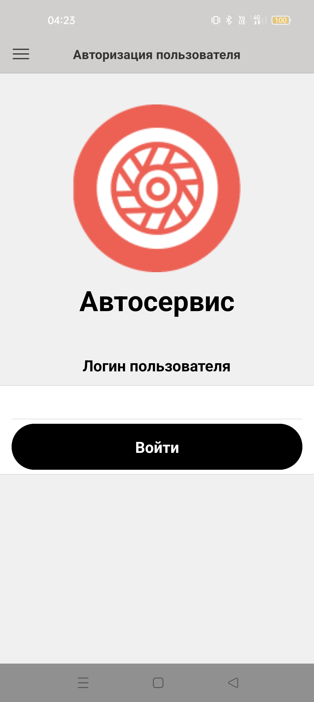
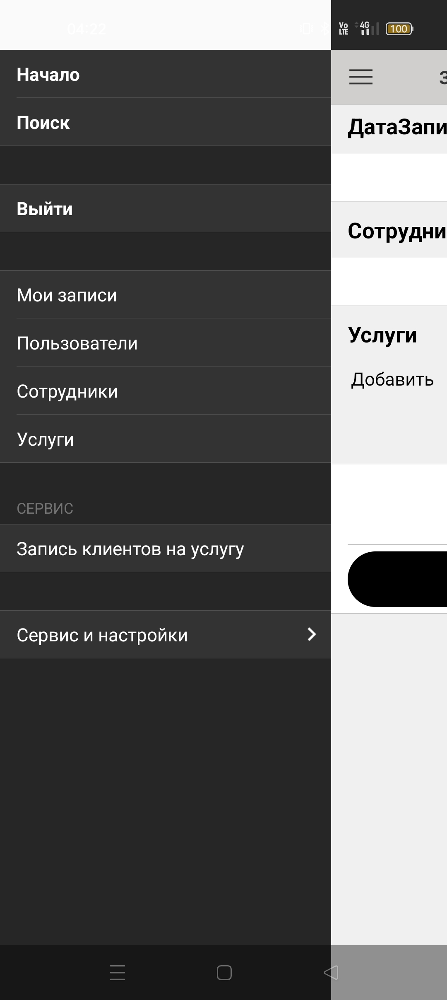
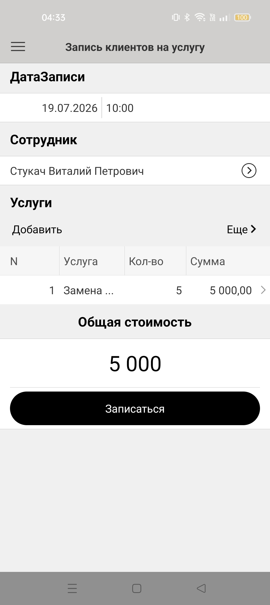
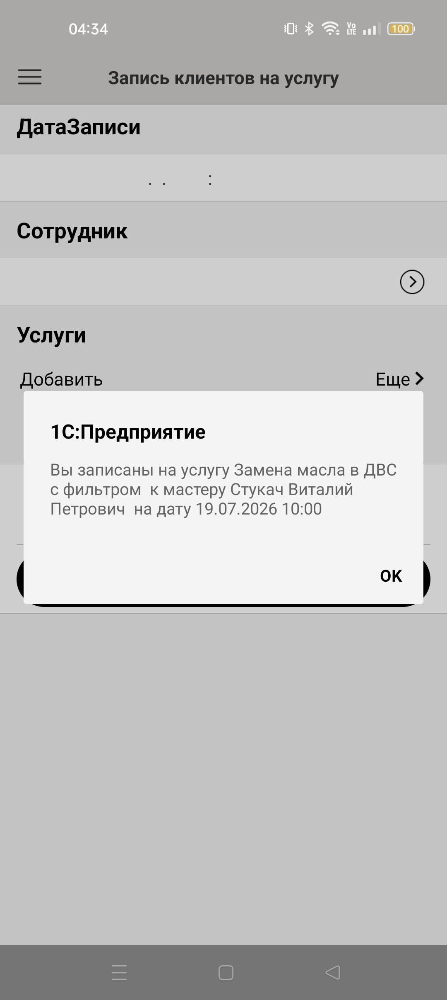
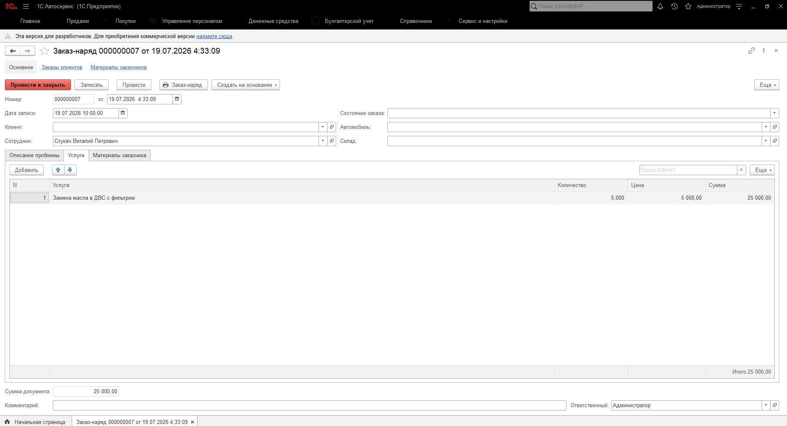
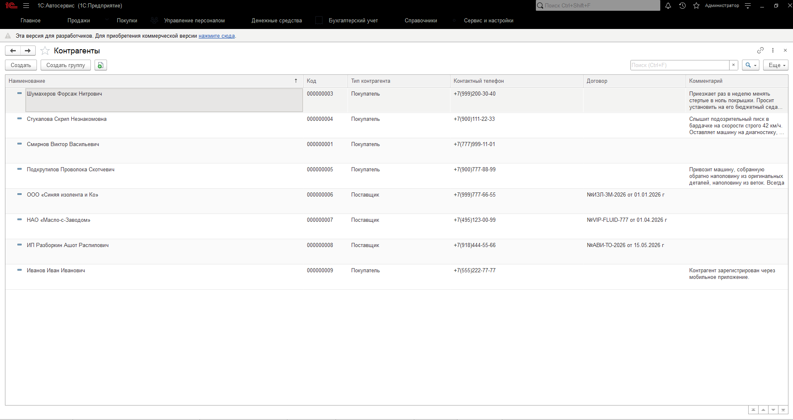

# 📱 Мобильное приложение клиента автосервиса (1С:Мобильная платформа)

## 📌 Описание проекта и архитектура
Автономное мобильное приложение, разработанное на «1С:Мобильной платформе» для интеграции с центральной десктопной ERP-системой автосервиса. Приложение спроектировано как клиентский интерфейс, позволяющий пользователям оперативно и безопасно регистрироваться в системе, просматривать доступные услуги/мастеров и оформлять онлайн-запись на ремонт со своих смартфонов.

Взаимодействие с центральной базой происходит по REST API через вызовы кастомных HTTP-сервисов с сериализацией данных в формате JSON.

## 🚀 Ключевой реализованный функционал системы

### 1. Архитектура метаданных и кэширование данных
* **Локальные справочники:** Спроектированы справочники `Услуги`, `Сотрудники` и `Пользователи`. 
* **Бизнес-эффект:** Приложение кэширует актуальные списки услуг и работающих мастеров непосредственно в локальной базе смартфона при синхронизации. Это обеспечивает мгновенный отклик интерфейса и экономию сетевого трафика.

### 2. Безопасность и разграничение прав доступа
* **Ролевая модель:** В структуре метаданных реализованы роли `НеавторизованныйПользователь` и `АвторизованныйПользователь`.
* **Бизнес-эффект:** Исключен несанкционированный доступ к созданию заявок. Функционал онлайн-записи и личного кабинета блокируется до тех пор, пока клиент не пройдет аутентификацию в системе.

### 3. Кастомный интерфейс и механизмы аутентификации
* **Экранные формы:** Разработаны специализированные общие формы `АвторизацияПользователя`, `РегистрацияПользователя` и добавлена общая картинка `ЛоготипАвторизации`.
* **Бизнес-эффект:** Создан кастомный, визуально понятный экран приветствия  при запуске приложения, заменяющий стандартные диалоги платформы и повышающий удобство использования.

### 4. Интерактивный мастер онлайн-записи
* **Пошаговые алгоритмы:** Разработан ключевой документ `ЗаписьКлиента` и специализированная обработка-мастер `ЗаписьКлиентовНаУслугу`.
* **Бизнес-эффект:** Реализовано удобное рабочее место , которое пошагово ведет клиента по процессу выбора услуги, подбора свободного мастера, бронирования даты/времени ремонта и отправляет готовый пакет данных в центральную ERP.

### 5. Модули интеграции и обработки JSON
* **Общие модули:** Логика обмена данными вынесена в специализированные общие модули `АутентификацияИАвторизация` и `ОбменСОсновнойБазой`.
* **Бизнес-эффект:** Приложение автономно формирует HTTP-запросы (методы GET/POST), осуществляет сериализацию локальных документов и десериализацию входящих пакетов JSON, обеспечивая бесшовный двусторонний обмен с сервером.

* 
## 📱 Визуализация работы и сквозная интеграция с Центральной базой

Ниже представлен пошаговый кейс, доказывающий полную работоспособность мобильного клиента, корректность UX/UI интерфейса и стабильность обмена данными с центральной ERP-системой через кастомные HTTP-сервисы в режиме реального времени.

Посмотреть пошаговый сквозной процесс обмена данными (7 скриншотов)

### Шаг 1. Авторизация в мобильном приложении
Кастомизированный экран входа под мобильные экраны с интеграцией корпоративного логотипа автосервиса и оптимизированными элементами управления.

---

### Шаг 2. Интерфейс навигации и структура мобильного меню
Настроенная командная панель в темной теме. Логика разделена на административный контур (справочники) и сервисный блок для оперативной работы мастера.

---

### Шаг 3. Оформление оперативной записи на автосервис
Рабочая форма документа «Запись клиентов на услугу». Табличная часть оптимизирована под вертикальные экраны, реализован автоматический вывод результирующих показателей.

---

### Шаг 4. Валидация и локальная фиксация данных
Система проверяет заполненность полей и через шаблонизатор строк динамически выводит подтверждение с параметрами записи перед отправкой в центральный узел.

---

### Шаг 5. Статус документа в локальном журнале
Документ успешно проведен во внутренней СУБД мобильной платформы, получил статус готовности к синхронизации и зафиксирован в журнале «Мои записи».

---

### Шаг 6. Прием пакета и расчет «Заказ-наряда» в Центральной базе
Результат отработки HTTP-сервиса бэкенда: в центральной базе автоматически создан документ «Заказ-наряд». Данные полностью идентичны мобильному вводу. На стороне сервера бэкенда успешно отработал пересчет сумм ТЧ.

---

### Шаг 7. Сквозная регистрация НСИ (Новых клиентов)
Пруф двусторонней интеграции: при регистрации нового пользователя на смартфоне, HTTP-сервис автоматически создает элемент в справочнике «Контрагенты» центральной базы с системной отметкой об источнике создания.

## 📂 Системные требования и развёртывание

### Системные требования:
* Платформа «1С:Предприятие 8.3» с установленной компонентой сборки мобильных приложений.
* Наличие мобильного устройства (Android / iOS) или настроенного эмулятора.

### Шаги для запуска проекта:
1. Создайте новую пустую мобильную информационную базу в Конфигураторе.
2. В главном меню выберите пункт: *Конфигурация ➡️ Открыть конфигурацию*.
3. Выберите пункт: *Конфигурация ➡️ Загрузить конфигурацию из файлов...* 
4. Укажите путь к папке с исходным кодом из данного репозитория.
5. Обновите конфигурацию базы данных (клавиша **F7**).

